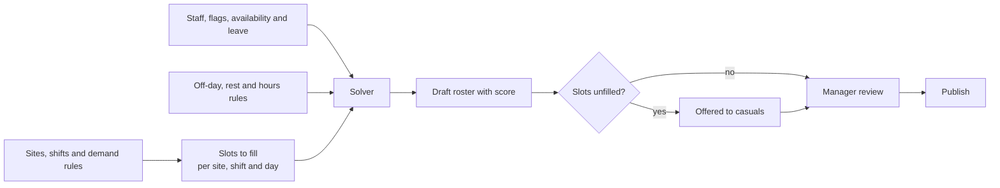
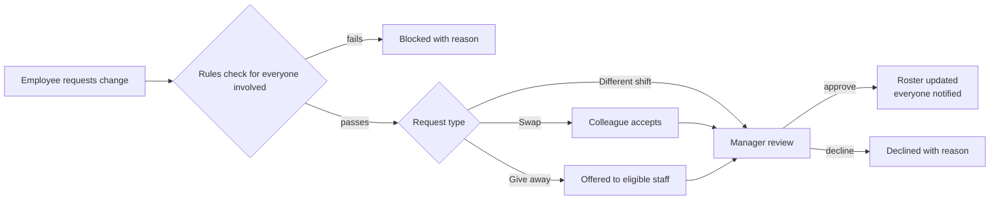
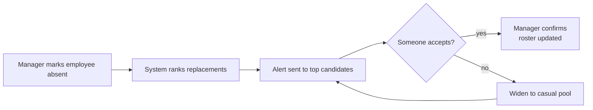

# Fuel Station Roster Requirements

2026-09-19 · @Someone

## 1. Business context and scope

This document specifies the roster for a fuel station business with two garages and several guarded buildings, and it is the detailed version of the roster module in [HR System Requirements](project/9aaf88d7-d422-4e3b-92b1-db08537e334a).

The owner owns two buildings and the business employs security guards, cashiers, petrol attendants, casual workers, office workers and senior management, each with different rules about where and when they work.

| Staff group | Known numbers | What they do | What makes rostering hard |
| --- | --- | --- | --- |
| Security guards | 6 in-house | Guard several buildings, 24 hours a day, every day of the year | Covering every building with few people, including their off-days |
| Cashiers | To confirm | Operate the POS terminals at the garages | The number needed changes with how many POS are open, and each must get their required off-days |
| Attendants | To confirm | Serve at the pumps of both garages | Shared between two garages: the main garage can have up to 4, the small garage always has exactly 1, and only flagged attendants may work there |
| Casual workers | To confirm | Fill gaps and busy periods | No fixed pattern, called in as needed |
| Office workers | To confirm | Office and administration work | Follow a weekday office pattern and work one weekend in, one weekend out, so weekend cover must alternate fairly and still respect rest rules |
| Senior management: senior manager, head field manager, head of operations | 3 roles, one person each (to confirm) | Oversee operations across the garages, buildings and office | Also work one weekend in, one weekend out, and the three must not leave a weekend uncovered if you require a senior person on duty |

**Design principles**

- **Everything is configurable data.** Garages, buildings, shifts, headcounts and rules are set up by an administrator, so a third garage or another building is a set-up task and not a software change.
- **Shifts belong to a site.** Each garage and building has its own shift times and lengths, because they do not run alike.
- **Eligibility is explicit.** Flags on an employee (for example "small garage eligible") decide where they may work, and the system enforces them everywhere, including shift swaps.
- **Generate first, then review.** The system produces a full draft and the manager only handles exceptions.
- **Every result can be explained.** Each unfilled shift, warning or blocked change says which rule caused it.

**In scope:** roster set-up, automatic generation, review and publishing, shift changes and swaps, emergency cover, casual call-out, roster reports and the link to payroll inputs. **Out of scope for now:** time clock or biometric attendance, integration with the fuel station's POS software, and payroll calculation.

## 2. Sites, buildings and posts

A **site** is any place that needs people, either a garage or a guarded building, and a **post** is a job to be filled there, such as "Main garage attendant" or "Building 1 guard".

- **SR-1.** Each site has a name, a type (garage, building or office), an address, operating hours (for example 05:00 to 21:00 for a garage, and 24 hours a day, every day of the year, for a guarded building) and an active flag, so a site can be closed without deleting its history.
- **SR-2.** A garage records its POS terminals individually (POS 1, POS 2 and so on) so the number open in each shift can be set.
- **SR-3.** Each guarded building has its own guard posts and its own required cover per shift, so security is planned building by building and not from one shared pool.
- **SR-4.** A guard post can be fixed to one building, rotate between buildings, or be a patrol post that covers several buildings in one shift.
- **SR-5.** An administrator can add a site, a POS or a post at any time, and it applies from the next roster that is generated; existing published rosters are not changed.
- **SR-6.** A person can be linked to several sites, and the roster decides each shift which site they work at.

An example set-up, to be confirmed with you:

| Site | Type | Post | How many people |
| --- | --- | --- | --- |
| Main garage | Garage | Attendant | Up to 4 per shift |
| Main garage | Garage | Cashier | One for every POS open in that shift |
| Small garage | Garage | Attendant | Exactly 1 at all times while open, from flagged attendants only |
| Small garage | Garage | Cashier | One per open POS, if it has any |
| Each guarded building | Building | Guard | Set per building and per shift |

## 3. Staff groups, flags and eligibility

Every employee belongs to a staff group, and **flags** decide which posts they may work, so the rule that only some attendants go to the small garage is enforced by the system and not by memory.

| Staff group | Normally works at | Example flags |
| --- | --- | --- |
| Security guard | Guarded buildings, and garages if needed | Security registration valid, night shift, patrol |
| Cashier | Garages with POS terminals | Cash handling cleared, approved sites |
| Attendant | Main garage; flagged attendants also the small garage | Small garage eligible |
| Casual | Only the posts each casual is approved for | Set per person |
| Office worker | The office | Weekend duty, on an alternating weekend rotation |
| Senior management | The office, with oversight of all sites | Weekend duty, on an alternating weekend rotation; approver for their sites |

- **SG-1.** Staff groups and flags are configurable lists, so an administrator can add a group such as supervisor or cleaner, or a flag such as "can open the shop", without new development.
- **SG-2.** A post can require one or more flags. The small garage attendant post requires "Small garage eligible", so an attendant without that flag is never placed there by the generator, by a manager, or through a shift swap.
- **SG-3.** HR adds or removes a flag with an effective date, and every change is logged with who made it.
- **SG-4.** A flag can have an expiry date, for example a security registration; the manager is warned ahead of expiry, and once it lapses the person cannot be rostered to posts that need it.
- **SG-5.** An employee can be approved for more than one site and more than one post, for example an attendant who is also a cashier at the main garage.
- **SG-6.** The admin site shows, for each flag, who holds it, so a manager can see at a glance how many attendants can cover the small garage.
- **SG-7.** Groups follow one of two kinds of pattern: shift-based (guards, cashiers, attendants and casuals), where the generator fills slots each shift, and pattern-based (office workers and senior management), which follow a weekday pattern plus an alternating weekend rotation as set out in section 6.

## 4. Shifts per site

Shifts are created for each garage or building separately, because the two garages and the security posts do not run the same hours.

- **SH-1.** A shift template belongs to one site (or a chosen group of sites) and has a name, start time, end time, an indicator that it crosses midnight, break setting (see Breaks and lunch below), paid hours, and pay flags for night, Sunday and public holiday.
- **SH-2.** Each site can have a different number of shifts and different lengths, for example three 8-hour shifts at one garage and a different pattern at the other; the real times are set by you.
- **SH-3.** Different templates can be used for weekdays, Saturdays, Sundays and public holidays at the same site.
- **SH-4.** A shift is generated only when the site is open, using the site's operating hours and the public holiday calendar.
- **SH-5.** Changes to shift times are effective-dated and never alter a roster that is already published.
- **SH-6.** A whole set of shifts and demand rules can be copied to a new site and then adjusted, so opening a third garage is quick to set up.
- **SH-7.** A post can be marked "continuous cover", such as the small garage attendant during opening hours and every guard post all day and night, and the generator then checks that consecutive shifts leave no gap, with an optional handover overlap in minutes.
- **SH-8.** Garages open from 05:00 to 21:00, so with 8-hour shifts the two garage shifts are 05:00 to 13:00 and 13:00 to 21:00; guarded buildings are covered 24 hours a day, every day of the year including public holidays, so security shifts must leave no gap at any hour.
- **SH-9.** A shift can start before opening or end after closing for set-up and cash-up, set per post, so a cashier can finish the day's cash reconciliation after 21:00.
- **SH-10.** Work between 18:00 and 06:00 is night work under the law, which includes the first hour of the 05:00 shift and the last three hours of the 13:00 to 21:00 shift as well as every security night shift. Shift templates carry a night-hours flag so night-work compensation and transport can be applied; confirm the requirements with your labour advisor.

An illustration only, with times to be replaced by yours:

| Site | Shift | Times | Paid hours |
| --- | --- | --- | --- |
| Main garage | Morning | 05:00 to 13:00 | 8 |
| Main garage | Afternoon | 13:00 to 21:00 | 8 |
| Small garage | Morning | 05:00 to 13:00 | 8 |
| Small garage | Afternoon | 13:00 to 21:00 | 8 |
| Guarded building | Day | 06:00 to 14:00 | 8 |
| Guarded building | Afternoon | 14:00 to 22:00 | 8 |
| Guarded building | Night | 22:00 to 06:00 | 8 |
|  |  |  |  |
|  |  |  |  |

### Breaks and lunch

By default a shift is **8 hours straight with no lunch or break**, and a manager can add a lunch to any shift, or remove it again, whenever the business decides.

| Break setting | Paid hours | Time on site | Meaning |
| --- | --- | --- | --- |
| None (default) | 8 | 8 hours | Straight through, no scheduled break |
| Unpaid lunch | 8 | 8 hours plus the lunch length | The person is free to leave the post, and the lunch is added to the end of the shift |
| Paid lunch | 8, lunch included | 8 hours | The person takes lunch at the post or stays available, and the lunch counts as worked time |

- **BR-1.** Every shift template has a break setting with the three options above, and an optional length in minutes and a preferred time window for the lunch.
- **BR-2.** A manager with the right permission can change the setting for a shift, a site, a staff group or a date range, with an effective date, and can remove lunch again at any time, so a decision such as "give lunch from next month" is one change.
- **BR-3.** A change applies to rosters generated from its effective date; a published roster is not changed unless the manager regenerates it.
- **BR-4.** The setting flows through to the roster: shift end times and time on site, paid hours, the monthly required hours (only paid hours count), and the pay inputs sent to payroll.
- **BR-5.** Short paid rest breaks, such as a tea break, can also be added or removed per shift and do not change paid hours.
- **BR-6.** Where a post needs continuous cover, such as the single small garage attendant or a cashier at a POS, the roster staggers lunches so the cover is kept, uses a relief person if one is set for that post, or warns that the post has no cover during lunch. An on-duty paid lunch at the post is the alternative for such posts.
- **BR-7.** The law requires a meal interval of at least one hour after more than five hours of continuous work. It can be reduced to 30 minutes by written agreement, and dispensed with only for someone who works fewer than six hours in a day. If the person is required to work or be available during the interval, it must be paid. A shift of more than 5 hours set to None therefore shows a compliance notice, and the administrator must acknowledge it and record the basis, for example a written agreement or a bargaining council rule that applies, before it is saved. Confirm the position with the bargaining council or your labour advisor.
- **BR-8.** A report lists shifts by break setting and any lunch-cover gaps, so the effect of a lunch decision on cover and hours can be seen before it takes effect.

## 5. Demand rules

Demand rules say how many people each site needs in each shift, and the generator turns them into **slots**, one slot for every person needed at a site, in a shift, on a day.

| Rule type | Meaning | Example |
| --- | --- | --- |
| Fixed | Exactly this many people, every time | Small garage attendant: exactly 1 |
| Range | At least the minimum, aiming for the target, never above the maximum | Main garage attendants: up to 4 |
| Per open POS | One person for each POS marked open in that shift | 4 POS open means 4 cashiers |
| Per building | A set number of guards for each building and shift | Building 1: 1 guard by day and 1 at night |
| Date override | Replaces any rule for a date or date range | Month-end: 2 extra POS open |
| Weekend cover | A minimum number of people from a group on duty each weekend | At least one of the senior managers on duty every weekend (to confirm) |

- **DR-1.** Every rule is tied to a site, shift, post and day type (weekday, Saturday, Sunday, public holiday).
- **DR-2.** Each shift records how many POS are open for each day type, and the number of cashiers required follows from it, so opening or closing a POS changes the cashier demand without editing any other rule.
- **DR-3.** For a range rule the minimum is a hard requirement, the target is what the generator aims for, and the maximum is never exceeded.
- **DR-4.** Date overrides can be set for a single date or a range, for any site, for events such as month-end, public holidays or a promotion.
- **DR-5.** When there are not enough people, administrators rank which slots are filled first, for example the small garage attendant and guard posts before an extra cashier.
- **DR-6.** A post can accept alternatives through flags, for example an attendant slot that a trained cashier may fill, configured per post.
- **DR-7.** Before generating, the admin site shows the demand for the period as a summary per site, shift and post, so the numbers can be checked.

**Worked example (illustration).** A weekday morning at the main garage with 4 POS open produces 4 cashier slots and up to 4 attendant slots; the small garage the same morning produces 1 attendant slot that only flagged attendants can fill; each guarded building produces its own guard slots for the morning.

## 6. Off-days, rest and hours

Every employee gets their required number of off-days, and no rule about rest or hours is broken, because **hard rules** can never be broken by the generator and **soft rules** are optimised and reported. The defaults below are starting points to confirm against the Basic Conditions of Employment Act and any sectoral determination or agreement that applies to security, retail or fuel station work.

| Rule | Type | Applies to | Suggested default |
| --- | --- | --- | --- |
| Required off-days | Hard | Per staff group, with per-person override | At least 1 full day off every week; the monthly required hours usually give 6 or 7 a month |
| Maximum consecutive days worked | Hard | All groups | 6 |
| Rest between shifts | Hard | All groups | 12 consecutive hours |
| Weekly rest | Hard | All groups | 36 consecutive hours |
| Ordinary hours per week | Hard | Per group and contract | Contracted hours; statutory maximum 45 |
| Overtime | Hard | All groups | Not more than 10 hours a week, with agreement |
| One shift per day, at one site | Hard | All groups | Cross-site double shifts off unless allowed |
| Night shifts in a row | Hard | Per group | Maximum set by you, with a rest day after a run of nights |
| Weekends off | Soft | Per group | A minimum number of full weekends off in a rolling 8 weeks |
| Fair share of nights, Sundays, public holidays and small garage duty | Soft | Per group | Balanced over a rolling 8 weeks |
| Preferences and continuity | Soft | All groups | Honour preferences; keep guards on the same building and cashiers on the same POS where possible |
| Required hours per month | Hard, within a tolerance | Per staff group, with per-person override | 192 for 30 and 31-day months, set by a manager |
| Meal interval | Hard, unless a recorded basis exists | All groups | Set by the shift's break setting; a shift over 5 hours with no meal interval shows a compliance notice |

- **OD-1.** The number of required off-days is set per staff group and can be overridden per person, for example for part-timers, and can be expressed per week or per rolling cycle.
- **OD-2.** Whether approved leave and public holidays count toward required off-days is a setting, and by default they do not.
- **OD-3.** The system tracks off-days delivered against required off-days on a rolling basis, and reports any shortfall for each person.
- **OD-4.** A manager with permission can override a hard rule for one shift, but must give a reason, and the override is logged and shown on the roster report.
- **OD-5.** Rules set for one employee are effective-dated and take precedence over the group default.
- **OD-6.** Small garage duty is shared fairly among the flagged attendants, so the same few people do not carry it every week.

### Monthly required hours by group

Every registered employee is rostered for **192 hours in a month of 30 or 31 days** by default, and a manager can set a different number of required hours for any staff group, and for one person where needed.

- **MH-1.** Required monthly hours is a setting on each staff group, with a default of 192 hours for months of 30 or 31 days, set by a manager who has the permission to do so, with the effective date, and every change is logged with who made it.
- **MH-2.** A person can have their own required hours that override the group figure, for example a part-timer, a new starter or someone on reduced hours, and the override is also effective-dated.
- **MH-3.** A change applies from the next roster period; a published roster is not changed.
- **MH-4.** The generator plans each person's hours across the whole month, so the target is met by month end and not only week by week, and hours are counted as paid shift hours, excluding unpaid breaks.
- **MH-5.** Approved paid leave and public holidays count toward the required hours by default, so someone on leave is not asked to make the hours up; this is a setting.
- **MH-6.** Shift lengths may not divide the target evenly, so a tolerance can be set (for example plus or minus 4 hours), and the generator gets as close as it can and shows the remaining difference.
- **MH-7.** The required hours never override a hard rule. If a person cannot reach their hours without breaking rest, weekly hours or off-day rules, the roster reports the shortfall and the rule behind it, and the manager chooses to allow overtime with the employee's agreement, reduce the target for that month, or accept the shortfall.
- **MH-8.** Each person's row shows scheduled hours against required hours (for example 184 of 192), coloured when outside the tolerance, and the group view counts how many people are under or over.
- **MH-9.** The month used for counting hours is a setting: the calendar month or the pay period (for example the 26th to the 25th), so it can match payroll.
- **MH-10.** A shortfall or excess can be carried into the next month up to a limit, or reset each month, as a setting.
- **MH-11.** Casuals have the same default, but a manager will normally set the casual group to its own figure or to none, because casuals are called in as needed; the weekly hours cap in section 7 still applies.
- **MH-12.** Hours above the required figure are flagged as overtime and can feed payrun input suggestions, and hours below are flagged to the manager.
- **MH-13.** Required hours are held per month length, one figure for months of 30 or 31 days and a separate figure for February, so the generator always uses the figure that belongs to the month being rostered.
- **MH-14.** The 45-hour weekly limit applies to every week and not only on average over the month, so hours above 45 in any week are overtime whatever the monthly total, unless a written averaging agreement applies. A shift longer than the daily limit (9 hours, or 8 if the person works more than 5 days a week) also counts partly as overtime unless a written compressed working week agreement covers it, which matters for any 12-hour shifts. Confirm which agreements apply to each group with the bargaining council or your labour advisor.

**The hours must agree with the off-days and shift lengths.** At 8-hour shifts, 192 hours is 24 shifts a month, which leaves 6 off-days in a 30-day month and 7 in a 31-day month; at 12-hour shifts it is 16 shifts, leaving 14 or 15 off-days. The set-up checks that the required hours, shift lengths and required off-days agree, and warns when they do not. Averaged over the month, 192 hours is about 44.8 hours a week in a 30-day month and 43.4 in a 31-day month, both under the 45-hour weekly limit, so a heavier week has to be balanced by a lighter one.

**February has its own figure.** The 192 hours applies to months of 30 or 31 days. For February (28 or 29 days) the manager sets a separate required figure for each group, and the suggested default is 192 scaled to the days in the month on a 30-day base: 192 x 28 / 30 is about 179 hours, and 192 x 29 / 30 is about 186. That averages 44.8 hours a week, which stays under the 45-hour weekly limit. Keeping 192 hours in February would average 48 hours a week and need overtime, so the system flags it if that figure is chosen.

**Office and management example (illustration).** In a month with 22 weekdays, 8-hour weekdays give 176 hours, so a Saturday of 8 hours on each of the two working weekends brings the total to 192 hours; the roster shows this gap for pattern-based groups so it can be planned.

### Alternating weekends for office and management staff

Office workers and senior management (the senior manager, head field manager and head of operations) follow a **weekday pattern with an alternating weekend**: they work one weekend and are off the next.

- **WR-1.** A staff group or an individual can be given a weekend pattern of "one weekend on, one weekend off". The pattern is a setting, so a different pattern, such as one weekend in three, can be used later without new development.
- **WR-2.** The weekday pattern is set separately for these groups (for example Monday to Friday office hours) with its own shift template at the office site, and the weekend duty has its own template with hours you set, whether a short Saturday, both days, or on call.
- **WR-3.** People in a group are split into two rotation teams that work opposite weekends, so someone is on duty every weekend; the split can be set by hand or suggested by the system for even cover, and changed with an effective date.
- **WR-4.** The rotation continues across roster periods, because the generator reads the last weekend each person worked, so nobody gets two weekends in a row when a new roster is generated.
- **WR-5.** If someone is on approved leave or off sick on their weekend, the weekend duty is offered to an available colleague in the same group, and the person's own rotation is kept unless a setting restarts it after leave.
- **WR-6.** A weekend cover rule (section 5) can require a minimum from a group each weekend, for example at least one of the senior managers, and the system reports any weekend that cannot be covered.
- **WR-7.** Rest rules still apply. Working Monday to Sunday is seven days in a row, and the run continues into the next Monday to Friday, which breaks the default limit of 6 consecutive days and the 36-hour weekly rest. For these groups the set-up therefore requires one of three choices: a day off in lieu in the week after a weekend worked, weekend duty of one day only, or a group-specific rule that you approve. The system shows this conflict before the roster is generated.
- **WR-8.** Weekends worked are counted per person over the year and reported, so fairness can be checked, and the weekend duty template carries a weekend pay flag so payrun input suggestions apply if company policy pays for it.
- **WR-9.** Two people in the same group can swap weekends, and the rest rules and weekend cover rule are checked before the swap is approved.

## 7. Casual workers

Casual workers fill the shifts that permanent staff cannot cover and the extra demand on busy days, and they are called in and not placed on a fixed pattern.

- **CW-1.** A casual worker is an employee record of type Casual, with the same profile, documents and flags as other staff, plus a pay basis (per shift, per hour or per day) and an optional weekly hours cap.
- **CW-2.** Each casual is approved for specific posts and sites, for example "attendant at the main garage only", and the system never offers them anything else.
- **CW-3.** Casuals give their availability by day and time, in the portal or through a manager, and the generator only considers them when available.
- **CW-4.** The generator fills slots with permanent staff first, respecting their off-days, and then offers what is left to casuals in a priority order that an administrator can change, by default the casual with the fewest hours this month first.
- **CW-5.** Offered shifts reach casuals by SMS or push notification with the site, shift and pay, and a casual accepts or declines; the first eligible acceptance is confirmed, or a manager chooses, as set per site.
- **CW-6.** A manager can also assign a casual directly, and the same eligibility, rest and hours rules are checked.
- **CW-7.** The system keeps a casual pool list with contact details, approved posts, last shift worked, and hours worked this month.
- **CW-8.** Shifts a casual actually worked, once confirmed by the manager, become pay inputs for the payrun (see section 11), so casuals are paid from the roster without re-capturing hours.
- **CW-9.** Casual use and cost are reported per site and month, so you can see where permanent cover is falling short.

## 8. Roster generation

The generator builds the slots from the demand rules, then assigns people to them within the rules, and hands the manager a draft with a score and a list of anything it could not do.



- **RG-1.** The generator runs on a schedule (by default weekly, for the four weeks starting a set number of weeks ahead) or on demand for any date range, site or staff group.
- **RG-2.** It first locks in approved leave, public holidays, pinned shifts and any fixed patterns, then fills the remaining slots.
- **RG-3.** It respects every hard rule in section 6 and every flag requirement in section 3, and never places an unflagged attendant at the small garage.
- **RG-4.** It optimises the soft rules: fair share of nights, Sundays, holidays and small garage duty, preferences, continuity, and the least overtime and casual cost.
- **RG-5.** A slot no permanent employee can fill becomes an open shift and is offered to casuals as described in section 7.
- **RG-6.** The result includes a quality score, a list of warnings and unfilled slots, and for each one the rule that caused it.
- **RG-7.** A manager can pin shifts and regenerate only the rest, or regenerate a single site or staff group, without disturbing pinned or published shifts.
- **RG-8.** A generation run for a normal month completes within a couple of minutes and runs in the background with progress shown.
- **RG-9.** Pattern-based groups (office workers and senior management) are placed first, from their weekday pattern and weekend rotation, before the shift-based staff are assigned.
- **RG-10.** The generator works toward each person's required monthly hours (section 6) across the whole month, and the draft roster lists everyone who is above or below their target and why.

**Staffing feasibility check.** Before generating, the system compares the shifts to be covered with the shifts your people can work under the off-day and rest rules, and tells you plainly if the roster is impossible and how many more people, of which group and flag, would fix it.

```latex
\text{people needed} = \left\lceil \frac{\text{shifts to cover per week}}{\text{shifts one person can work per week}} \right\rceil
```

For example, if the small garage needs one flagged attendant from 05:00 to 21:00 in two 8-hour shifts, that is 14 shifts a week, and if each attendant may work 5 shifts a week, at least 3 flagged attendants are needed. The same check is run for each guarded building and for the cashiers against the open POS count.

**Security example (illustration).** Six guards at 192 hours each give 1,152 guard-hours a month. One guard post covered around the clock needs 720 hours in a 30-day month and 744 in a 31-day month, so six guards can cover about one and a half posts at all times. If more buildings need a guard at every hour, the check shows how many more guards are needed, or whether patrol posts that cover several buildings in one shift would close the gap.

**What-if planning.** A manager can change the open POS count, add a building post or remove someone for a period, and see the effect on coverage and required staff before anything is changed for real.

## 9. Manager review and publishing

Managers review the draft in views that match how they think about the business, fix exceptions, and publish, and each manager sees only the sites they are responsible for.

- **MR-1.** The roster has three views: by site (shifts across days, with people in each slot), by person (each employee's days and off-days), and by staff group (for example all guards across all buildings).
- **MR-2.** Every shift shows a coverage indicator such as 3 of 4, coloured when below minimum, and open shifts are clearly marked.
- **MR-3.** A person shared between the two garages appears on both garages' views, and a day where they are at the other site is shown as such and not as free.
- **MR-4.** A manager can drag a person to another slot, and the rule check runs at once, explaining any breach, including a missing flag such as the small garage flag.
- **MR-5.** Hard rule breaches are blocked unless the manager has override permission, and then a reason is required and logged.
- **MR-6.** Each person's row shows off-days delivered against required off-days and hours against their limit.
- **MR-7.** Publishing locks the roster, notifies every affected employee and casual, and stores a version; later changes go through the shift change flow in section 10 or a logged manager edit that respects the minimum notice set in settings.
- **MR-8.** Managers are scoped by site: a garage manager sees and edits their garage and the shared staff's shifts there, and the owner and senior management (senior manager, head field manager and head of operations) can see across sites, with what each may edit set by role.

## 10. Shift changes, swaps and emergency cover

Employees can ask to change a published shift, and managers can cover a no-show quickly, always with the same eligibility and rest rules as the generator.

### 10.1 Employee shift change requests



- **SC-1.** The rules check covers required flags, rest hours, weekly hours, overtime limit, required off-days and approved leave for every person involved, so an unflagged attendant cannot swap into the small garage.
- **SC-2.** A swap between two people who both satisfy the post can be set to approve automatically; otherwise the manager approves.
- **SC-3.** A request must be made a minimum number of hours before the shift, and a request nobody answers expires and returns to the requester.
- **SC-4.** Statuses are Requested, Awaiting colleague, Awaiting manager, Approved, Declined, Expired and Cancelled, and every change notifies the people involved.
- **SC-5.** Approved changes update the published roster, keep the earlier version, and refresh calendar feeds.

### 10.2 No-show and emergency cover



- **SC-6.** When someone calls in sick or does not arrive, the manager marks the shift and the system ranks replacements: people with the right flags and site approval, enough rest, hours left and not on a required off-day come first, then casuals.
- **SC-7.** Candidates are alerted by SMS or push, and the first eligible acceptance is confirmed or a manager chooses, as configured per site.
- **SC-8.** Where the absent person held a continuous-cover post such as the small garage, the alert is marked urgent and the manager is told at once if no one accepts.
- **SC-9.** Someone asked to work on a required off-day can accept only if an override is recorded, and that off-day is owed back later.

## 11. Outputs, reports and links to payroll

The roster produces printable schedules, reports that show whether the rules are being met, and pay inputs so payroll does not depend on re-typed hours.

- **OP-1.** Each site's published roster prints or exports to PDF for the notice board, and every roster exports to Excel.
- **OP-2.** Each employee and casual sees their own shifts in the portal and can subscribe to a calendar feed on their phone.
- **OP-3.** Approved leave writes into the roster and frees the slot, and leave that is cancelled removes the open shift again where it has not been filled.
- **OP-4.** Confirmed shifts feed payrun input as suggested lines for night, Sunday and public holiday shifts and overtime, which the employee or manager confirms, and casual shifts feed pay at the casual's rate.

| Report | Question it answers |
| --- | --- |
| Coverage by site and shift | Where were we below minimum, and how often |
| Off-days delivered against required | Who is owed off-days |
| Hours and overtime per person | Who is near or over their limits |
| Small garage duty share | Are flagged attendants sharing the small garage fairly |
| Guard cover by building | Was every building covered every shift |
| Casual usage and cost | How much do we depend on casuals, per site and month |
| Unfilled and emergency shifts | How often we needed emergency cover and why |
| Rule overrides | Who overrode which rule, when and why |

## 12. Configuration and data model

No site name, headcount, shift time or rule value is written into the program: all of it lives in configuration tables that an administrator edits, which is what makes the roster dynamic.

- **CF-1.** Rules, shifts, headcounts and flags are stored as data with effective dates and history, so a change from next month does not rewrite last month.
- **CF-2.** Every configuration change is written to the audit log with who, what, old value, new value and time.
- **CF-3.** A set-up guide walks an administrator through a new site in order: site, POS terminals, posts, shifts, demand rules, then which staff are approved to work there.
- **CF-4.** Staff, flags and site approvals can be imported from a spreadsheet, with a check report before anything is saved.

| Entity | Purpose | Key fields |
| --- | --- | --- |
| Site | A garage or guarded building | Type, operating hours, active |
| POS | A terminal at a garage | Site, name, active |
| StaffGroup | Security, Cashier, Attendant, Casual and any you add | Name, default rules |
| Post | A job at a site | Site, staff group, required flags, continuous cover |
| Flag and EmployeeFlag | Who may do what | Employee, flag, effective date, expiry date |
| SiteApproval | Which sites and posts a person may work | Employee, site, post |
| ShiftTemplate | A shift belonging to a site | Site, day type, start, end, breaks, paid hours, pay flags |
| OpenPOS | How many POS are open in a shift | Shift, day type, count |
| DemandRule | How many people a post needs | Site, shift, post, day type, rule type, minimum, target, maximum, priority |
| DemandOverride | Changed demand for dates | Site, date range, changed values |
| RuleSet | Off-day, rest and hours rules | Staff group or employee, parameters, hard or soft, effective dates |
| Availability | When a person can or cannot work | Employee, day, time range, preference |
| CasualProfile | Casual pay and limits | Pay basis, rate, weekly cap, priority order |
| Roster and RosterVersion | A period's roster and its history | Period, status, version, published time |
| Shift | One person in one slot | Employee, site, shift template, post, date, pinned, source |
| OpenShift and ShiftOffer | Unfilled slots and offers to people | Slot, offered to, response, time |
| ShiftChangeRequest | Swaps, give-aways and changes | Type, people, shift, status, approver |
| RuleOverride | A logged exception | Rule, shift, user, reason |

## 13. Test scenarios

The roster is accepted when each of these scenarios passes with real data from the two garages and the guarded buildings.

| # | Scenario | Expected result |
| --- | --- | --- |
| 1 | Generate four weeks of roster | Every small garage shift has exactly 1 attendant, and each one holds the small garage flag |
| 2 | A manager drags an unflagged attendant into the small garage | Blocked, with a message naming the missing flag |
| 3 | Generate the main garage roster | No shift has more than 4 attendants, and none is below the minimum without a warning |
| 4 | Set 4 POS open on weekday mornings, then change it to 3 | The roster shows 4 cashier slots, then 3 after regeneration, with no other rule edited |
| 5 | Generate a month for all cashiers | Everyone receives their required off-days each cycle, and the off-day report shows no shortfall |
| 6 | Run with 6 guards and every guarded building | Every building is covered in every shift, or the feasibility check states how many more guards are needed |
| 7 | Leave one main garage attendant slot unfilled | It is offered only to available casuals approved for that post, and the roster updates when one accepts |
| 8 | Two eligible attendants swap shifts | The swap is approved under the site's setting and the roster and calendar feeds update |
| 9 | An unflagged attendant requests a swap into the small garage | Blocked at the rules check |
| 10 | Mark the small garage attendant absent at short notice | Ranked replacements are alerted urgently, the first eligible acceptance is confirmed, and the roster updates |
| 11 | A guard's security registration expires mid-period | The manager is warned beforehand, and the guard is not rostered after the expiry date |
| 12 | Approve leave for a rostered cashier | The slot is freed and re-offered, and the person is not shown as working |
| 13 | An administrator adds a third garage with its shifts and demand rules | A roster is generated for it with no code change |
| 14 | Publish a roster and then edit it | The edit requires a reason or a swap request, and both versions are kept |
| 15 | Generate 8 weeks for office workers and senior management | Each person works every second weekend only, and every weekend has at least one person from the group on duty |
| 16 | Generate a new period after one is published | The rotation continues from the last weekend worked, so no one works two weekends in a row across the boundary |
| 17 | A head of department is on leave on their weekend | Weekend duty is offered to an available colleague, and the weekend cover rule is still met or a warning is shown |
| 18 | Set the office group to work Monday to Friday plus both weekend days | The set-up shows the consecutive-days and weekly-rest conflict and asks for a day off in lieu, a one-day weekend or an approved group rule |
| 19 | Generate a 30-day month and a 31-day month with the default of 192 required hours | Every person is scheduled 192 hours within the tolerance, or the shortfall list names the rule that prevented it |
| 20 | A manager changes one group's required hours to 160 from next month | The change applies from the next period and is logged, the published roster is unchanged, and a per-person override still wins |
| 21 | Generate February with its own required hours | The February figure is used (about 179 hours for 28 days by default), and if 192 is chosen instead, the clash with the 45-hour weekly limit is flagged |
| 22 | Approve a week of paid leave for a cashier | The leave hours count toward the month's required hours, so the cashier is not rostered extra shifts to make them up |
| 23 | Create an 8-hour shift with the break setting None | Paid hours and time on site are both 8, and a compliance notice must be acknowledged with a recorded basis before it is saved |
| 24 | Switch a site to a 30-minute unpaid lunch from next month | From that month shifts show 8 paid hours and 8.5 hours on site, monthly hours still count 8 per shift, and earlier published rosters are unchanged |
| 25 | Switch a site to a paid lunch | Paid hours stay at 8 with the lunch included, and the person stays on duty at the post |
| 26 | Enable an unpaid lunch at the small garage | The roster shows who covers the single attendant post during lunch, or warns that it has no cover |
| 27 | Remove the lunch again | Shifts return to 8 hours straight from the next roster, and end times and paid hours update |
| 28 | Generate a month for the garages and the guarded buildings | No garage shift falls outside 05:00 to 21:00 except allowed set-up or cash-up time, and every guard post is covered every hour of every day, including public holidays |
| 29 | Ask for more guard posts than the six guards can cover | The feasibility check says the roster is impossible and states how many more guards, or which patrol posts, are needed |
| 30 | Roster the 05:00 to 13:00 and 13:00 to 21:00 garage shifts | The night-hours flag marks 05:00 to 06:00 and 18:00 to 21:00 so night-work rules can be applied |

## 14. Open questions and assumptions

These answers set the real numbers in the examples above, so they are worth settling before build starts.

- [ ] Are the two buildings the owner owns the two garages, or separate properties that are guarded? Which buildings need guards, and how many guards per building in the day and at night?
- [ ] Do the guards work fixed buildings or rotate, and do they work 12-hour or 8-hour shifts?
- [ ] Do both garages keep 05:00 to 21:00 every day, including Sundays and public holidays, and does anyone start before opening or finish after closing for set-up and cash-up?
- [ ] How many cashiers, attendants and casual workers are there, and how many attendants hold the small garage flag?
- [ ] How many POS are at each garage, does the small garage have a POS and a cashier, and does the number of open POS change by time of day?
- [ ] For the main garage, is 4 attendants the target or only the maximum, and what is the minimum?
- [ ] How many off-days must each group get (per week or per cycle), and should Sundays and public holidays be rotated fairly?
- [ ] Who covers the POS when a cashier is on a break, and may attendants and cashiers cover each other's posts?
- [ ] How are casuals paid (per shift, per hour or per day), and should a manager confirm each casual acceptance or should the first to accept get it?
- [ ] Does a sectoral determination or bargaining council agreement apply to the guards, cashiers or attendants?
- [ ] Who is the responsible manager for each garage and for the guarded buildings?
- [ ] How many office workers are there, and are the senior manager, head field manager and head of operations one person each?
- [ ] On their working weekend, do office workers and senior management work Saturday only, both days, or are they on call, and for what hours?
- [ ] Should the office group be split into two teams that work opposite weekends, or does each person alternate on their own, and must at least one of the three senior people be on duty every weekend?
- [ ] Do they get a day off in lieu during the week after a weekend worked, or is a weekend day part of their normal pay?
- [ ] Do the senior manager, head field manager and head of operations need rostering at all, or only a calendar showing whose weekend it is?
- [ ] Are the 192 hours counted per calendar month or per pay period, and should paid leave and public holidays count toward them?
- [ ] Do casual workers have required hours, and which managers may change the required hours for a group?
- [ ] Should hours above 192 be paid as overtime, and should a shortfall or excess carry over to the next month?
- [ ] What should the required hours be for February (28 or 29 days)? The suggested default is 192 scaled to the days in the month, about 179 hours.
- [ ] When lunch is given, should it be paid (on duty at the post) or unpaid (free to leave), and how long: 30 or 60 minutes?
- [ ] Who covers the small garage and the POS while the single attendant or cashier is at lunch?
- [ ] Is there a written agreement or a bargaining council rule about meal intervals for your staff? The law requires one after more than five hours of continuous work, with limited exceptions.
- [ ] Does "at least one day off a week" mean a full calendar day, and should it include Sunday? The legal weekly rest is 36 consecutive hours, which includes Sunday unless agreed otherwise.
- [ ] Does each guarded building need a guard at every hour, or can one guard patrol several buildings in a shift?
- [ ] Is transport provided for people who start at 05:00 or finish at 21:00, given that work between 18:00 and 06:00 counts as night work?

**Working assumptions:** the times, headcounts and off-day numbers in the examples are illustrations, statutory defaults are confirmed by you before go-live, the roster reuses the employee records, leave and payrun input from the HR system, and guards can also be rostered to a garage if you need it.
