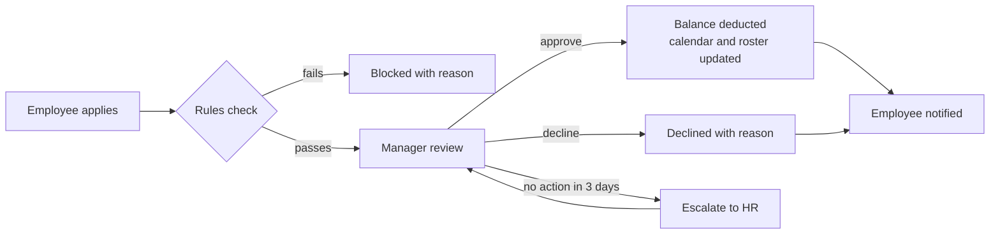
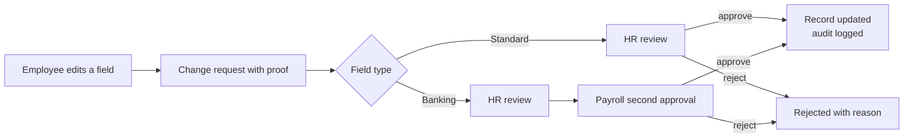
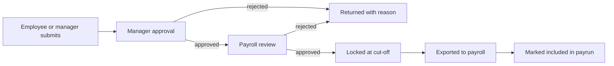
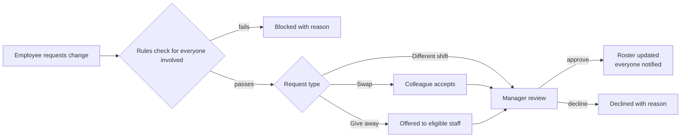

# HR System Requirements

2026-09-19 · @Someone

## 1. Overview

The system is a web-based HR platform with two sides: a mobile-first employee portal (client side) and an admin site for HR, payroll and managers, built around the modules in your screenshots plus an auto-generated roster.

The screenshots show a payroll-vendor self-service portal. The landing page is "This is me" (photo, name, job title, employer banner, then a Personal section with known-as and surname, gender, race, date of birth, age, retirement age and work email). The side menu groups Employee Self Service (This is me, Payslips, Leave, Biographical Details, Payrun Input, Tax Certificate, Documents) and Employee Relations, with Logout, a notification bell, a "more" menu and a company selector at the top.

**Goals**

- One source of truth for employee data, with employees able to see and request changes to their own record.
- Every request (leave, profile change, payrun input, document, shift change, grievance) follows a defined workflow with an approver, statuses, notifications and an audit trail.
- A roster that generates itself from rules, so managers only handle exceptions.
- Works well on a phone, because the reference portal is used mostly on mobile.

**How each screenshot module maps to the two sides**

| Module | Client side (employee) | Admin side (HR / payroll / manager) |
| --- | --- | --- |
| This is me | View profile and personal details | Maintain employee master record |
| Payslips | View and download payslips | Upload or import payruns, publish payslips |
| Leave | Balances, apply, cancel, history, calendar | Leave types and rules, approve, adjust balances |
| Biographical Details | View and request changes (address, contacts, banking, qualifications) | Review and approve or reject changes |
| Payrun Input | Submit claims and variable inputs (overtime, allowances, expenses) | Approve inputs, lock and export to payroll |
| Tax Certificate | View and download by tax year | Generate or import certificates, publish |
| Documents | View, download, upload, sign | Manage document types, templates, requests |
| Employee Relations | Log grievances, view warnings and cases | Case management, warnings, hearings, outcomes |
| Roster (new) | See my shifts, request a change or swap | Shift templates, rules, auto-generate, approve changes |

**Assumptions:** one company to start with (the company selector is supported in the data model so more can be added later), South African context (tax certificates, BCEA-style leave, POPIA), and payroll calculation stays in your existing payroll tool at first, with this system handling inputs, payslip delivery and certificates.

## 2. Roles and permissions

Five roles cover the system, and every request is scoped by the reporting line, so a manager only sees their own team and an employee only sees their own record.

| Capability | Employee | Line Manager | HR Admin | Payroll Admin | Super Admin |
| --- | --- | --- | --- | --- | --- |
| View profile | Own | Team (limited fields) | All | All | All |
| Edit employee master data | Request only | No | All | Banking and tax fields | All |
| Approve profile change | No | No | Yes | Second approver on banking | Yes |
| Apply for leave | Own | Own | Own | Own | Own |
| Approve leave | No | Team | Override | No | Yes |
| Leave types, rules, balance adjustments | No | No | Yes | No | Yes |
| View payslips | Own | No | No (configurable) | All | All |
| Upload and publish payruns | No | No | No | Yes | Yes |
| Submit payrun input | Own | On behalf of team | No | Yes | Yes |
| Approve payrun input | No | First level | No | Final level and lock | Yes |
| Tax certificates | Own | No | No | Generate and publish | All |
| Documents | Own plus company policies | Team (allowed types) | All | Payroll documents | All |
| Employee relations | Own cases | Raise and view assigned | Full | No | Full |
| View roster | Own and team-mates | Team | All | Read only | All |
| Generate and edit roster | No | Team | All | No | All |
| Approve shift change or swap | No | Team | Override | No | Yes |
| Users, roles, settings, audit log | No | No | No | No | Yes |

**Rules that apply to all roles**

- Nobody approves their own request; if a manager is the requester, it goes to the next level up.
- Banking detail changes need two approvers (HR Admin and Payroll Admin) before they take effect.
- A manager can delegate approvals to another manager for a date range, for example when on leave.
- One person can hold more than one role, and switches between the employee view and the admin view from the same login.
- Admin roles must use two-factor authentication; all role and permission changes are written to the audit log.

## 3. Client side (employee portal)

The employee portal is mobile-first, mirrors the menu in your screenshots (Employee Self Service, Employee Relations, Logout) and adds a Roster item, and every action an employee takes becomes a request with a visible status.

### 3.1 Sign-in and navigation

- Sign in with work email or employee number and password; force a password change on first login; support password reset by email or SMS and optional fingerprint or face login through the phone's built-in biometrics.
- Sessions time out after a configurable period of inactivity, and Logout ends the session.
- A company selector appears at the top of the menu only when the user is linked to more than one company.
- A notification bell shows an unread dot, and a "more" menu holds help, change password and language.

### 3.2 This is me

- The landing page shows photo, name, job title and the employer banner, followed by a Personal card: known-as and surname, gender, race, date of birth, age (calculated), retirement age (from company policy), work email, phone, employee number, start date, department, manager and employment status.
- The employee can upload their own profile photo; HR approval on photos is a setting.
- Sensitive fields such as ID number and bank account are masked and only revealed after the employee re-enters their password.

### 3.3 Payslips

- Payslips are listed by month and tax year, newest first, and open in the app or download as PDF, optionally password-protected under company policy.
- A payslip shows earnings, deductions, employer contributions, net pay and, optionally, leave balances; a year-to-date summary sits above the list.
- Only published payslips are visible, and the employee is notified when a new one is published.

### 3.4 Leave

- Balances are shown per leave type (annual, sick, family responsibility, parental, unpaid, study and others HR configures) as accrued, taken, pending and available.
- Applying for leave asks for type, dates, half-day option, reason and attachment; the system calculates working days after excluding weekends, public holidays and roster days off.
- Validation covers insufficient balance, overlapping requests, blackout periods, minimum notice and mandatory medical certificates after a configurable number of sick days.
- The employee can track status (pending, approved, declined, cancelled), cancel a pending request, and ask to cancel an approved one, which goes back to the manager.
- A team calendar shows who is off, with names or just "unavailable" depending on a company setting, and a leave statement can be downloaded.

### 3.5 Biographical details

- Sections cover contact details, address, emergency contacts, next of kin, dependants and beneficiaries, banking details, qualifications, skills, driver's licence, medical aid, and ID or work-permit expiry dates.
- An edit never changes the record directly: it creates a change request that shows old and new values side by side, accepts proof (proof of address, bank letter) and applies automatically once approved.
- Legal name, ID number, date of birth, race and gender are read-only for the employee and changed only by HR with a supporting document.

### 3.6 Payrun input

- The employee can submit variable inputs for the coming payrun: overtime hours, shift allowances, expense and travel claims with receipts, advance or loan requests, and deduction requests.
- Each payrun shows its cut-off date; a late submission either rolls into the next payrun or is blocked, depending on a setting.
- Statuses run draft, submitted, manager approved, payroll approved, included in payrun, or rejected with a reason; the employee can edit only while it is a draft.

### 3.7 Tax certificate

- Certificates are listed by tax year and certificate type and can be viewed and downloaded as PDF; a year with no certificate yet shows "not yet issued".
- The employee is notified when certificates are published, and can raise a correction request that goes to Payroll Admin.

### 3.8 Documents

- **My documents:** contract, offer letter, ID copy, qualifications and certificates, viewable and downloadable, with employee uploads (for example a medical certificate) tagged by document type and expiry date, scanned for malware and limited by size and file type.
- **Company library:** policies, handbook and forms, read-only, with a "read and understood" acknowledgement that HR can report on.
- **Document requests:** the employee can ask for an employment letter, proof of employment or salary advice; the system fills a template and routes it to HR or Payroll for release.
- **Signing:** contracts and policy acknowledgements can be e-signed, with timestamp, IP address and a locked copy stored.

### 3.9 Employee relations

- The employee can raise a grievance or report an incident with category, description, attachments and a confidential flag, and follow its status without seeing internal HR notes.
- Warnings and disciplinary outcomes issued to the employee appear here; the employee acknowledges receipt and can lodge an appeal within the appeal period.
- Invitations to hearings and meetings show date, time, venue, the right to representation, and a confirm-attendance button.
- An optional anonymous reporting channel routes to a restricted HR group.

### 3.10 My roster

- Weekly and monthly views show my shifts with time, location, role, breaks and who else is on the same shift.
- The employee is notified when a roster is published or one of their shifts changes, and can subscribe to a calendar feed (ICS) for their phone.
- The employee sets availability and preferences (days or times they cannot work, preferred shifts), which the roster generator respects.
- Shift change and swap requests are made here and are described in section 6.

### 3.11 Notifications

- The bell lists every event (approvals, publications, roster changes, reminders) with a link to the item, and supports mark-all-read.
- Email is always sent for approvals and publications; SMS or push are optional, and the employee chooses channels per category.

## 4. Admin site

The admin site is a separate desktop-first area for HR, payroll and managers where they maintain data, work through approval queues and run reports; what each person sees depends on their role in section 2.

### 4.1 Dashboard and task queue

- One inbox of pending approvals: leave, profile changes, payrun inputs, document requests and shift changes, each with age and a link to act.
- Widgets for who is absent today, upcoming expiries (work permits, contracts, probation end, licences), payrun cut-off countdown and roster coverage gaps for the week.

### 4.2 Employee master data and organisation

- Create and edit employees: personal, employment, job title, department, cost centre, manager, contract type, dates and custom fields, with salary and banking fields visible only to roles that need them.
- Changes such as transfers, promotions and pay changes are effective-dated, so history is kept and the employee's record shows the right value on any past date.
- Onboarding and offboarding checklists assign tasks to HR, IT and the manager, and termination flags the employee for final pay.
- Bulk import and export by CSV or Excel, with a validation report before anything is saved.
- Organisation structure: companies, branches or sites, departments, positions and reporting lines.

### 4.3 Leave administration

- Leave types with accrual rules, carry-over and expiry, negative-balance rule, paid or unpaid, and documentation rules; leave policies apply to groups of employees.
- Public holiday calendar per country or site, a scheduled accrual run, and manual balance adjustments that require a reason and are logged.
- HR can approve, decline or override any request and capture leave on behalf of an employee, for example sick leave phoned in.

### 4.4 Payroll, payrun input and payslips

- Define pay periods (monthly, weekly or fortnightly) with an input cut-off date for each payrun.
- Consolidate approved payrun inputs into one list per payrun, lock it at cut-off, and export it in the format the payroll tool needs.
- Import payslips as a batch (a PDF that is split per employee, or a data file), preview them, match to employees, and publish immediately or on a schedule.
- Unpublish and reissue a corrected payslip while keeping the earlier version in the history.

### 4.5 Tax certificates

- Set up tax years, import or generate certificates per employee, publish in bulk, and reissue with version history.
- See who has viewed or downloaded their certificate, and work through correction requests from employees.

### 4.6 Document management

- Define document types as personal or company, with required-or-optional, expiry tracking and retention period.
- Build templates with merge fields (name, ID, job title, start date, salary) for letters, contracts and proof of employment, and generate them singly or in bulk.
- Publish policies to all employees or a group, and track who has acknowledged them, with reminders to those who have not.
- A queue of employee document requests shows the requester, age and status.

### 4.7 Employee relations case management

- Case types cover grievance, misconduct, incapacity and poor performance; each case has an owner, an investigator, a timeline, attachments and a status.
- Schedule hearings and meetings from the case, send notices from templates, and record outcomes, sanctions and appeal results.
- Warnings carry a validity period and expire automatically, and repeated warnings for the same offence are flagged to the manager and HR.
- Notes and evidence are visible only to the users assigned to the case, and every view is logged.

### 4.8 Roster setup

- Maintain sites, positions, skills, shift templates, coverage requirements and generation rules (detailed in section 6).
- Generate, review, edit, publish and lock rosters, and approve or override shift change requests.

### 4.9 Reports

- Headcount and movements, turnover, leave balances and leave liability, absenteeism, payrun input summary, document expiry, employment equity breakdown, roster coverage and overtime, and workflow turnaround times.
- Every report filters by company, department, site and date, exports to CSV, Excel or PDF, and can be emailed on a schedule.

### 4.10 System settings and security

- Users, roles and permissions, company branding (logo, banner, colours), and public holiday and calendar setup.
- Workflow configuration: approval chains, escalation after a set number of days, delegation rules and payrun cut-offs.
- Notification and letter templates, integration settings, data retention rules and a searchable audit log of who changed what and when.

## 5. Workflows

Every request uses the same engine: a submitter, one or more approvers, defined statuses, an escalation timer, notifications at each step and an audit entry for each decision.

**Rules common to all workflows**

- A rejection must include a reason, which the requester sees.
- If an approver does not act within a configurable time (default 3 working days), the request is reminded, then escalated to the next level or to HR.
- Approvers can act from the app or from a secure link in the notification email.
- A requester can withdraw a request until the final approval, and the approvers are told.
- Approval chains, timers and cut-offs are set in admin settings, not in code.

### 5.1 Leave request

The rules check covers balance, overlap, blackout periods, minimum notice and required attachments, and an approved leave day replaces any rostered shift on that day, which goes back to the roster as an open shift.

### 5.2 Biographical change request

### 5.3 Payrun input

### 5.4 Other workflows

| Workflow | Steps | Statuses | Notified |
| --- | --- | --- | --- |
| Payslip publishing | Payroll uploads batch, system matches to employees, Payroll previews, publishes now or on a schedule | Draft, Previewed, Published, Withdrawn | Employees on publish; Payroll on unmatched records |
| Tax certificate | Payroll imports or generates, previews, publishes; employee can request a correction and Payroll reissues | Draft, Published, Correction requested, Reissued | Employees on publish and reissue |
| Document request | Employee requests, HR or Payroll generates from template, reviews, releases | Requested, In progress, Released, Declined | Employee on each change |
| Policy acknowledgement | HR publishes policy, employees read and accept, reminders go to those outstanding | Published, Acknowledged, Overdue | Employees, then HR report |
| Grievance or case | Employee or manager raises, HR triages and assigns, investigation, hearing, outcome, employee acknowledges, appeal window, close | Raised, Triaged, Under investigation, Hearing scheduled, Outcome issued, Appeal, Closed | Parties involved and HR, with restricted visibility |
| Warning | Manager or HR issues, employee acknowledges or appeals, warning expires after its validity period | Issued, Acknowledged, Appealed, Expired | Employee, manager, HR |
| Onboarding and offboarding | HR starts checklist, tasks go to HR, IT and manager, employee record activated or closed at the end | Open, In progress, Complete | Task owners and HR |
| Shift change or swap | See section 6 | See section 6 | See section 6 |

## 6. Roster and shift scheduling

The roster generates itself from coverage needs, employee availability and labour rules, then a manager reviews and publishes it, and employees can request changes afterwards within the same rules.

### 6.1 What the generator needs as input

- **Structure:** sites or locations, positions and skills, and any certifications that must be valid to work a position.
- **Shift templates:** name, start and end time, unpaid breaks, paid hours, and flags such as night shift, weekend or public holiday.
- **Coverage requirements:** the minimum and maximum headcount per site, day, shift and position, including different needs for weekends and holidays.
- **Employees:** contracted hours per week, employment type, home site, skills, and any fixed pattern (for example four days on and two off).
- **Availability and preferences:** entered by employees in the portal (section 3.10) and approved by the manager where the company requires it.
- **Calendar data:** approved leave, public holidays, and shifts worked in previous weeks so fairness can be measured.

### 6.2 Rules the generator must follow

Hard rules can never be broken; soft rules are optimised and the roster shows a score and any warnings. Defaults below are starting points to confirm against the Basic Conditions of Employment Act and any sectoral or bargaining council agreement that applies to your business.

| Rule | Type | Suggested default |
| --- | --- | --- |
| Ordinary hours per week | Hard | Contracted hours; statutory maximum 45 |
| Ordinary hours per day | Hard | 9 for a five-day week, 8 for a six-day week |
| Rest between shifts | Hard | 12 consecutive hours |
| Weekly rest | Hard | 36 consecutive hours |
| Overtime | Hard | Not more than 10 hours a week, with employee agreement |
| Maximum consecutive days worked | Hard | 6 |
| Approved leave and unavailable times | Hard | Never rostered |
| Required skill or valid certification | Hard | Employee must hold it |
| Fair share of weekend, night and holiday shifts | Soft | Balanced over a rolling 8 weeks |
| Employee shift preferences | Soft | Honoured where coverage allows |
| Continuity of teams and site | Soft | Prefer the same team and site |
| Overtime and cost | Soft | Minimise |

### 6.3 How the roster is generated

1. The generator runs on a schedule (default: every Monday, for the week that starts four weeks ahead) or on demand for any date range.
2. It locks in approved leave, public holidays, fixed patterns and any shifts a manager has pinned.
3. It fills the remaining coverage using a constraint solver that respects every hard rule and optimises the soft rules.
4. It produces a draft roster with a quality score, a list of warnings, and a list of open shifts it could not fill.
5. Regenerating a range keeps pinned shifts, so a manager can fix part of the roster and let the system redo the rest.

### 6.4 Manager review and publishing

- The manager sees the draft as a grid (employees down, days across) and can drag a shift to another person or day, with the rule check running live and explaining any breach.
- A breach of a hard rule is blocked unless the manager has permission to override, in which case a reason is required and logged.
- Publishing locks the roster, notifies every affected employee, and creates a version; after that, changes go through the shift change flow or a logged manager edit with the minimum notice set in settings.

### 6.5 Shift change and swap requests

Employees can ask for a swap with a colleague, give a shift away, or ask for a different shift; managers can also change a shift themselves and the employee is notified.

- The rules check runs for both people in a swap: rest hours, weekly hours, overtime limit, skills and certifications, and approved leave.
- A swap between two employees with the same position and skills can be set to auto-approve when the check passes; otherwise the manager approves.
- Requests must be made a minimum number of hours before the shift starts, and a request that no one answers expires and is returned to the requester.
- Statuses are Requested, Awaiting colleague, Awaiting manager, Approved, Declined, Expired and Cancelled; each change notifies the people involved.
- Once approved, the published roster updates, the old and new versions are kept, and the calendar feeds refresh.

### 6.6 Open shifts and coverage gaps

- A shift becomes open when leave is approved, an employee gives it away, someone leaves, or the generator could not fill it.
- Open shifts are offered to eligible employees only (skills, rest rules and hours limit all satisfied), on a first-to-claim basis or by manager choice, per company setting.
- The dashboard shows unfilled shifts and coverage below minimum for the coming two weeks.

### 6.7 Outputs and links to other modules

- Rosters export to PDF and Excel for printing, and each employee has a calendar feed.
- Approved leave writes into the roster, and roster overtime and night or weekend shifts can pre-fill payrun input for the employee to confirm (phase 2).

## 7. Notifications and audit trail

Notifications drive every workflow, and the audit trail records every change so any decision can be explained later.

| Event | Who is notified | Channels |
| --- | --- | --- |
| Request submitted (leave, change, input, document, shift) | Approver | In-app, email |
| Request approved, declined or expired | Requester | In-app, email, optional SMS or push |
| Approval overdue | Approver, then escalation contact | Email, in-app |
| Payslip or tax certificate published | Employee | In-app, email |
| Roster published or shift changed | Affected employees and manager | In-app, email, optional SMS or push |
| Open shift available | Eligible employees | In-app, push |
| Document expiring or policy awaiting acknowledgement | Employee and HR | Email, in-app |
| Hearing or meeting invitation | Parties involved | Email, in-app |
| Payrun cut-off approaching | Employees with draft inputs, managers with pending approvals | Email, in-app |

**Audit trail**

- Every create, edit, approval, rejection, publication, login, failed login, export and permission change records who, what, old value, new value, time and IP address.
- Audit entries cannot be edited or deleted by any role, and viewing sensitive records (salary, banking, employee relations cases) is logged too.
- The audit log is searchable by employee, user, module and date range and exports to CSV.
- Notification templates are editable by Super Admin, with placeholders for names, dates and links.

## 8. Data model

About 50 entities in eight areas carry the whole system, and a shared workflow entity lets leave, changes, inputs, documents and shift changes all use the same approval engine.

| Area | Entities | Notes |
| --- | --- | --- |
| Organisation | Company, Site, Department, Position, CostCentre | Every record carries a company reference so more companies can be added later |
| People and access | Employee, EmploymentRecord, User, Role, Permission, ReportingLine | EmploymentRecord is effective-dated, so pay, job and manager changes keep history |
| Biographical | Address, Contact, EmergencyContact, Dependant, BankAccount, Qualification, ChangeRequest | ChangeRequest stores old value, new value, proof and approval state |
| Leave | LeaveType, LeavePolicy, LeaveBalance, LeaveTransaction, LeaveRequest, PublicHoliday | LeaveTransaction is a ledger of accruals, usage and adjustments behind each balance |
| Payroll | PayPeriod, PayrunInput, InputType, Payslip, TaxCertificate | Payslip and TaxCertificate keep versions and a published flag |
| Documents | DocumentType, Document, DocumentTemplate, DocumentRequest, PolicyAcknowledgement | Files live in private storage and are served through signed, time-limited links |
| Employee relations | Case, CaseEvent, Warning, Appeal | Restricted access, with every view logged |
| Roster | ShiftTemplate, CoverageRequirement, Availability, Roster, RosterVersion, Shift, ShiftChangeRequest, RuleSet | Shift is one person on one template on one day, linked to a roster version |
| Platform | WorkflowDefinition, WorkflowInstance, ApprovalStep, Notification, NotificationTemplate, AuditLog | AuditLog is append-only |

Sensitive fields (ID number, bank account, salary) are encrypted at rest, and deleted records are marked inactive instead of being removed so history stays intact.

## 9. Non-functional requirements

The system holds ID numbers, bank details and salary data, so security and privacy come first, followed by fast, reliable use on a phone. Targets below are proposals to confirm.

| Area | Requirement | Target |
| --- | --- | --- |
| Security | HTTPS everywhere, strong password rules, lockout after repeated failures, two-factor authentication for admin roles, optional biometric login on phones | Mandatory before go-live |
| Access control | Role-based permissions plus scoping by reporting line, department and site | Tested for every role |
| Data protection | Encryption at rest for ID, banking and salary fields; private file storage with signed, expiring download links; secrets kept outside the source code | Mandatory |
| Privacy (POPIA) | Purpose and consent recorded for special personal information such as race and health documents, data minimisation, employee access to their own data, retention schedule, breach response procedure | Confirm with legal advisor |
| Uploads | Malware scan, file type and size limits | 10 MB per file |
| Performance | Pages load quickly on a mid-range phone on 4G | 95% of pages under 2 seconds |
| Scale | Start with a small workforce, designed to grow | 500 employees now, 5,000 later |
| Background jobs | Roster generation, payslip import and reports run in the background with progress shown | Roster for 200 staff over 4 weeks in under 2 minutes; 1,000 payslips imported in under 5 minutes |
| Mobile | Responsive design that can be installed on the home screen and works on low-end Android phones and slow connections | Mandatory for the employee portal |
| Availability | Planned maintenance outside working hours | 99.5% per month |
| Backup and recovery | Daily backups with a tested restore | Maximum 24 hours of data lost, back within 4 hours |
| Accessibility and language | Readable contrast, keyboard use in admin, English first and ready for translation | WCAG 2.1 AA for main flows |
| Browsers | Current and previous version of Chrome, Edge, Firefox and Safari; Android 8 and iOS 15 or newer | As stated |
| Quality | Separate development, test and production environments, automated tests for workflows and roster rules | Every release |

## 10. Integrations and technical approach

Start with file-based links to the existing payroll tool and a Django web application with one database, and add direct integrations only when they earn their cost.

**Suggested technical approach**

| Layer | Suggestion |
| --- | --- |
| Application | Django with a REST API, so the admin site, the employee portal and a future mobile app share one back end |
| Front end | Responsive web pages installable as a home-screen app; a mobile app only if the portal proves insufficient |
| Database | MySQL or PostgreSQL, with effective-dated tables and an append-only audit table |
| Background work | A task queue or scheduled tasks for roster generation, payslip import, reminders and reports |
| Roster solver | Google OR-Tools CP-SAT, which handles hard and soft scheduling constraints well |
| Files | Private object or file storage with signed links |
| Hosting | A server that supports background workers and daily backups; confirm your current host allows long-running jobs before committing to it |

**Integrations**

| Integration | Purpose | Phase |
| --- | --- | --- |
| Payroll tool (file-based) | Import payslips and tax certificates as PDF or data files; export approved payrun inputs as CSV | 1 |
| Email (SMTP) | Notifications and approval links | 1 |
| SMS gateway | Optional alerts and password reset | 1 |
| Calendar feed (ICS) | Roster and leave on the employee's phone calendar | 2 |
| Phone biometrics (passkeys) | Fingerprint or face sign-in | 2 |
| Payroll tool (API) | Two-way sync of employees, inputs and payslips, if the vendor offers an API | 3 |
| Time and attendance devices | Clock-in data for roster comparison and overtime | 3 |
| Single sign-on (Microsoft or Google) | One login for staff who already use these | 3 |

## 11. Delivery phases

Build in three releases, starting with the parts every employee uses monthly (payslips, leave, profile), then the roster and employee relations, then integrations. Durations are rough estimates for one to two developers and should be re-checked once scope is agreed.

| Phase | Scope | Rough duration |
| --- | --- | --- |
| 1. Foundation and self service | Login, roles and two-factor authentication; organisation and employee master with bulk import; This is me; biographical change requests; payslips; tax certificates; documents and document requests; full leave with approvals; workflow engine, notifications, audit log; basic reports | 8 to 10 weeks |
| 2. Roster, payrun input and employee relations | Roster setup, auto-generation, review, publishing, shift swaps and open shifts, calendar feed; payrun input with export to payroll; employee relations cases and warnings; e-signing; onboarding and offboarding checklists; full report set | 8 to 10 weeks |
| 3. Integrations and refinement | Payroll API, time and attendance devices, single sign-on, roster-to-payrun pre-fill, analytics dashboards, second language | 6 to 8 weeks |

A release is accepted when each requirement in this document that belongs to it works for the relevant roles on a phone and on a desktop, every workflow has been run end to end with test users, and the audit log shows the actions taken.

## 12. Open questions and assumptions

The answers to these questions change scope, so they are worth settling before build starts.

- [ ] By "client side" I assumed the employee-facing portal. If you meant a system that serves several client companies (each with their own employees and branding), the data model already carries a company on every record, but tenant separation and per-client branding would need to be added to phase 1.
- [ ] How many employees, sites and companies must it support at launch?
- [ ] Is payroll calculated in this system or in another tool? This document assumes another tool that can export payslips and tax certificates as PDF or data files and accept a file of payrun inputs.
- [ ] What shift patterns do you run (fixed rotation, 12-hour shifts, 24/7, retail hours), and are employees salaried or paid by the hour?
- [ ] Does a sectoral determination or bargaining council agreement apply to you? It can change the rest, overtime and night-work rules in section 6.2.
- [ ] Should clock-in and attendance be part of this system, or only planned shifts?
- [ ] Which leave types, accrual rules, carry-over rules and sick-leave cycle should be set up at the start?
- [ ] Should managers see payslips of their team, and who besides HR and Payroll approves banking changes?
- [ ] Which languages are needed for the employee portal?
- [ ] What existing data must be migrated (employee list, leave balances, historic payslips, documents)?
- [ ] Who is your Information Officer, and will a legal advisor review the privacy and retention approach?

**Working assumptions:** one company at launch, English first, mobile-first employee portal, file-based payroll link, statutory defaults confirmed by you before go-live, and the same company selector, banner and menu style as the reference screenshots.
