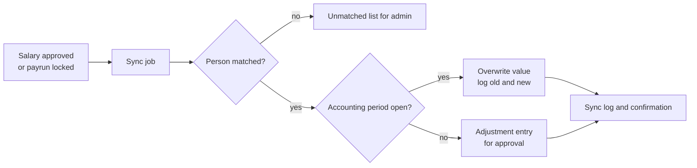
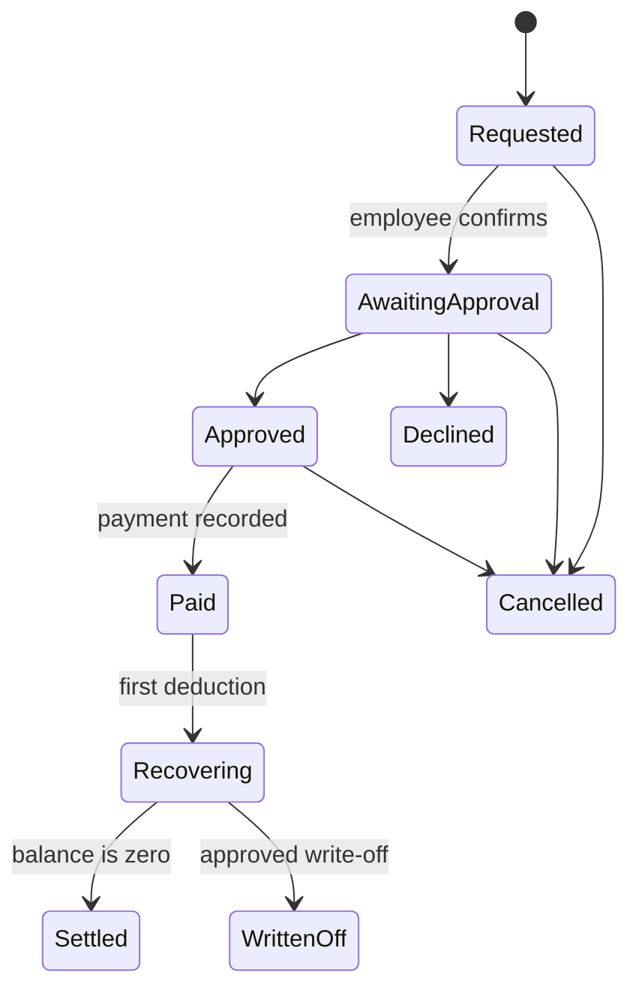

# Salary Advances and Salary Sync Requirements

2026-09-19 · @Someone

## 1. Answer and scope

Salary advances are only partly covered so far: [HR System Requirements](project/9aaf88d7-d422-4e3b-92b1-db08537e334a) lets an employee ask for an advance as one line in payrun input, but has no advance policy, limits, payment record, recovery schedule or balance, and nothing that sends salaries to the reconciliation system. This document specifies both.

| Question | Covered so far? | Where |
| --- | --- | --- |
| Can an employee request an advance? | Partly, as a payrun input line | HR requirements, sections 3.6 and 5.3 |
| Advance policy, limits and eligibility | No | Section 4 here |
| Staff who come to the counter and ask for an advance | No | Section 4 here |
| Recovery from salary, balance and early settlement | No | Section 5 here |
| Salaries captured in the HR system overwrite the reconciliation system | No | Section 3 here |
| Advances shown in the reconciliation cash records | No | Section 6 here |

The module has two parts: **salary master data and sync** (sections 2 and 3), which makes the HR system the source of truth for pay, and **salary advances** (sections 4 to 6), which handles requests, approval, payment and recovery.

This changes one earlier assumption. The HR system now holds each employee's salary and is the source of truth for it, while the payroll calculation itself can still be done in your payroll tool.

## 2. Salary master data

The HR system holds one salary record for each employee, and every other system, including the reconciliation system, takes its salary figures from it.

- **SM-1.** A salary record has the employee, pay type (monthly salary, weekly wage, hourly rate or per-shift rate for casuals), amount, currency, pay frequency, start date, end date, reason for the change and who approved it.
- **SM-2.** A record can also list fixed allowances and fixed deductions as named lines, each with its own amount and dates, so the total pay of a person is the sum of the active lines on any date.
- **SM-3.** Salary records are effective-dated and never edited in place: a change creates a new record and closes the old one, so earlier payslips and reports still show the salary that applied then.
- **SM-4.** A salary change is captured by HR Admin and approved by Payroll Admin before it takes effect, and the person who captured it cannot approve it; increases above a threshold you set also need approval from senior management.
- **SM-5.** Only HR Admin, Payroll Admin and Super Admin can see or change salaries; managers do not see their team's salaries by default, and an employee sees their own pay through payslips.
- **SM-6.** Casual workers have rates set by post or per person, and the roster uses them to work out what a confirmed shift pays.
- **SM-7.** Salaries can be loaded from a spreadsheet for the first import, with a check report showing new, changed and rejected rows before anything is saved.
- **SM-8.** Every view, change and approval of a salary is written to the audit log, and a salary history report shows all changes for a person or period.
- **SM-9.** The HR system is the only place where a salary can be entered; in the reconciliation system salary fields become read-only, as described in section 3.

## 3. Sync to the reconciliation system

Salaries captured and approved in the HR system overwrite the salary figures in the reconciliation system, and the reconciliation system stops accepting salary entries of its own.

The reconciliation dashboard shows an Expenses module with a Salaries category, so this document assumes salaries there appear as salary values per person and as Salaries expense entries. The exact tables and fields are to be confirmed against the code before build.

| What is overwritten | Source in the HR system | When |
| --- | --- | --- |
| Salary rate or amount per person | Approved salary record (section 2) | On the effective date of a change |
| Monthly Salaries expense entries | Locked payrun totals per person | When a payrun is locked |
| Advance recoveries and advances paid | Advance ledger (section 5) | When an advance is paid and each time it is recovered |

- **SY-1.** The direction is one-way, from the HR system to the reconciliation system, and the HR value always wins when the two differ.
- **SY-2.** Each HR employee is linked to the matching person in the reconciliation system by employee number, and a person who cannot be matched is listed for an administrator and is never guessed.
- **SY-3.** The sync runs when a salary change takes effect, when a payrun is locked, on a nightly check, and on demand from the admin site.
- **SY-4.** Before overwriting, the sync records the old value, the new value, the time and the source record, so no salary is ever replaced silently and every overwrite can be traced.
- **SY-5.** Salary fields and salary entries in the reconciliation system become read-only, marked as coming from the HR system, so a figure cannot be edited there by hand and then be overwritten later without anyone noticing.
- **SY-6.** Where the accounting period is already closed or its financial statements have been issued, the sync does not change the closed figures; it creates an adjustment entry in the open period that a finance user must approve, and shows the difference.
- **SY-7.** The sync is safe to repeat: running it twice gives the same result and never creates duplicate entries.
- **SY-8.** A failed sync is retried, and if it still fails Payroll Admin and Super Admin are alerted with the reason, and the HR record shows a sync status of pending or failed.
- **SY-9.** A daily comparison report lists every person whose salary in the reconciliation system differs from the HR system, so any leftover mismatch is visible.
- **SY-10.** If both systems run in the same project and database, the sync happens in one transaction with the HR change; if they run separately, it uses a secured interface with an access token, and either way the reconciliation side is not changed by anything except the sync.
- **SY-11.** The first load compares every existing reconciliation salary against the HR figures and produces a report before anything is overwritten, so surprises are found and decided by you first.

## 4. Salary advances

Employees can ask for an advance in the portal or come to a manager and have it captured for them, and every advance follows one policy, one approval path and one payment record.

**Policy settings** (set per staff group by an administrator; the values are examples to confirm):

| Setting | Example |
| --- | --- |
| Advances allowed | Yes for permanent staff; casuals only against shifts already worked |
| Maximum amount | A fixed rand amount or a percentage of pay earned to date this month |
| Open advances at once | 1 |
| Minimum days between advances | Set by you |
| Eligibility | Minimum months of service, no unpaid balance above a limit, not on a final warning |
| Recovery | Next payrun, or spread over up to a set number of payruns |
| Approval tiers | Up to one amount by the garage or office manager, above it by the head of operations |

- **AD-1.** The employee portal shows the person's eligibility and the most they can ask for before they submit, and explains why if they are not eligible.
- **AD-2.** The maximum available is worked out as pay earned to date (from the salary record and, for casuals and shift workers, the shifts actually worked in the roster) minus advances still outstanding, and is capped by the policy.
- **AD-3.** A request records the amount, reason, how it will be recovered and the date needed.
- **AD-4.** For staff who come to the counter, a manager, HR or an authorised supervisor can capture the request on the employee's behalf by employee number or name, and the system records who captured it.
- **AD-5.** Whoever the request is made through, the employee must confirm it themselves, by a one-time code sent to their phone or by signing on screen, and that confirmation is stored as their written agreement to have the amount deducted from their pay. Confirm the exact wording of the deduction agreement with your legal advisor.
- **AD-6.** Approval follows the tiers in the policy, the approver can never be the requester, and a manager can approve an emergency advance outside the limits only with a written reason and a second approver.
- **AD-7.** The payment method is recorded as cash from a named till or petty cash, electronic transfer, or paid with the next payrun, with the amount, date and who paid.
- **AD-8.** For a cash advance the payer prints or signs a receipt, and the payment is recorded at once so the day's cash reconciliation is correct (see section 6).
- **AD-9.** No interest or fee is charged by default, and if the business wants one it is a policy setting, shown to the employee before they confirm.
- **AD-10.** The requester, the approvers and the payer are notified at each step, and an advance that is approved but not yet paid for a set number of days is flagged.

## 5. Advance workflow and recovery

Each advance moves through a fixed set of statuses, and the amount is recovered from pay by a schedule that is agreed when the advance is approved.

- **RC-1.** Every advance has one of the statuses above, the history of each change with who and when, and a balance that always equals the amount paid minus deductions and repayments.
- **RC-2.** When an advance is approved, a recovery schedule is created with an amount for each payrun, the employee can see it, and the schedule cannot exceed the policy or a set share of the person's pay in any payrun.
- **RC-3.** Scheduled deductions flow automatically into payrun input as advance recovery lines, are approved with the payrun, and appear on the employee's payslip as a separate line.
- **RC-4.** If pay in a payrun is too low to take the full deduction, the deduction is limited so net pay never goes below zero, and the remainder moves to the next payrun.
- **RC-5.** An employee can settle early by paying cash or a larger deduction, and the repayment is recorded with a receipt and updates the balance and the reconciliation records.
- **RC-6.** When a termination is captured, any outstanding balance is shown to HR and offered as a deduction from final pay, with the employee's agreement recorded; anything left is reported to HR and finance for a repayment plan or a write-off.
- **RC-7.** An advance can be cancelled before it is paid; after payment it can only be reversed by recording a repayment.
- **RC-8.** A write-off needs approval from senior management with a written reason, and it is recorded in the reconciliation system in its own category.
- **RC-9.** The system blocks a second open advance beyond the policy and warns when the same person has an advance captured at more than one place on the same day.
- **RC-10.** Managers can see advances for their own team as amounts and balances, while salary amounts stay hidden from them under section 2.

## 6. Links to payrun, payslips and reconciliation records

Every money movement of an advance is recorded once in the HR system and shown in the reconciliation system, so cash, salaries and balances agree.

| Event | HR system | Reconciliation system |
| --- | --- | --- |
| Salary approved | Salary record becomes active | Salary value overwritten (section 3) |
| Advance approved | Advance ledger opened | Nothing yet |
| Advance paid in cash from a till | Payment recorded with receipt | Cash outflow "Salary advance" on that till, shift and day, with the employee |
| Advance paid from petty cash | Payment recorded with receipt | Petty cash outflow "Salary advance" |
| Advance paid by transfer | Payment recorded with bank reference | Bank outflow "Salary advance" |
| Deduction taken in a locked payrun | Ledger balance reduced, shown on payslip | Advance owed reduced; Salaries expense follows the payrun total |
| Repayment in cash | Repayment recorded with receipt | Cash inflow on the till or petty cash |
| Write-off approved | Status Written off | Expense entry in its own write-off category |

- **LK-1.** A cash advance is recorded in the reconciliation system at the moment it is paid, against the till, shift or petty cash it came from, carrying the employee, amount, reference and the HR advance number, so the day's cash reconciliation balances.
- **LK-2.** A cash advance can only be marked as paid from a till that has an open shift or from petty cash, chosen by the payer, and never without a till or fund.
- **LK-3.** A cash advance paid from a cashier's till is treated as an approved outflow and does not appear as a cashier variance or shortage in the variance reports.
- **LK-4.** The unrecovered balance of all advances is available to the reconciliation reports and to the balance sheet as staff advances owed to the business.
- **LK-5.** An advance is not counted as a Salaries expense when it is paid, and a recovery is not counted as income; the Salaries expense follows the payrun total.
- **LK-6.** A reconciliation report compares the payrun totals in the HR system with the Salaries expense in the reconciliation system for each month, and any difference is shown for correction.
- **LK-7.** The payslip shows gross pay, advance recovery as its own line, other deductions and net pay, and the advance balance remaining.
- **LK-8.** The accounting treatment above, especially for the balance sheet and write-offs, is confirmed with your accountant before build.

## 7. Controls, audit and reports

Money and pay data carry the highest risk in the system, so the controls below are requirements and not options.

- **CT-1.** Segregation of duties: the person who captures a request, the person who approves it and the person who pays it are three different people, except where a small business setting allows two and records that it did.
- **CT-2.** Salary and advance permissions are separate roles, so someone who can pay advances cannot change salaries.
- **CT-3.** Every request, confirmation, approval, payment, deduction, repayment, write-off and sync is written to the audit log with who, what, old and new values, time and device.
- **CT-4.** Approved and paid advances cannot be edited or deleted; they can only be cancelled or reversed by a new entry.
- **CT-5.** Limits are enforced by the system and cannot be overridden by editing the record, only through the emergency path in section 4 with a reason and a second approver.
- **CT-6.** Salary and advance screens mask amounts by default and reveal them only to permitted roles, and exports of them are logged.

| Report | Question it answers |
| --- | --- |
| Advances by person and month | Who took how much, and how often |
| Outstanding advances | What is owed to the business now, by person and age |
| Recovery schedule | What will be deducted in each coming payrun |
| Advances paid by till and petty cash | Where the cash went, tied to the daily reconciliation |
| Policy exceptions | Emergency advances and overrides, with reasons and approvers |
| Leavers with a balance | Advances still owing after someone left |
| Salary changes | Every change to a salary, with approver and effective date |
| Sync status and differences | Which salaries are not yet matched between the two systems |

## 8. Data model

| Entity | Purpose | Key fields |
| --- | --- | --- |
| SalaryRecord | One effective-dated salary for a person | Employee, pay type, amount, frequency, start, end, reason, status, approved by |
| SalaryLine | A fixed allowance or deduction inside a salary | Salary record, name, amount, dates |
| SalaryApproval | Approval steps for a salary change | Salary record, step, approver, decision, time |
| AdvancePolicy | Rules for advances | Staff group, maximum, open advances, eligibility, recovery limits, approval tiers |
| Advance | One advance | Employee, amount, reason, status, captured by, confirmed by employee, approved by |
| AdvanceConfirmation | The employee's written agreement | Advance, method (code or signature), time, device, stored copy |
| AdvancePayment | Money paid out | Advance, method, till or fund, amount, reference, paid by, receipt |
| RecoverySchedule | Planned deductions | Advance, payrun, amount, status |
| AdvanceLedger | Every movement on the balance | Advance, type (payment, deduction, repayment, write-off), amount, date, source |
| SyncLink | HR person matched to the reconciliation person | Employee, reconciliation person, matched by, time |
| SyncLog | Every overwrite or failure | Record, target, old value, new value, status, time, reason |
| AdjustmentEntry | Change proposed for a closed period | Period, person, difference, status, approver |

All amounts are stored with currency, and no salary or advance record is ever deleted, only ended, cancelled or reversed.

## 9. Test scenarios

| # | Scenario | Expected result |
| --- | --- | --- |
| 1 | Approve a salary change effective next month | The old salary stays until that date, then the new salary is active and overwrites the reconciliation value, with a sync log entry |
| 2 | Someone edits a salary directly in the reconciliation system | Not possible, because the field is read-only and marked as coming from the HR system |
| 3 | Change a salary for a month whose accounting period is closed | The closed figures are untouched and an adjustment entry is created for approval |
| 4 | Run the sync twice | The second run makes no changes and creates no duplicates |
| 5 | An employee has no match in the reconciliation system | Listed as unmatched, and nothing is overwritten or guessed |
| 6 | An employee asks for an advance above their limit | The portal shows the maximum and blocks the request |
| 7 | A manager captures an advance for someone at the counter | The employee confirms with a one-time code, and the request records who captured it |
| 8 | The requester tries to approve their own advance | Blocked |
| 9 | Pay a cash advance from a till with an open shift | The reconciliation cash record shows the outflow at once and the cashier variance is unchanged |
| 10 | Lock a payrun with a scheduled recovery | The deduction appears on the payslip and the advance balance falls |
| 11 | Net pay is too low for the full deduction | Only the possible amount is taken and the rest moves to the next payrun |
| 12 | A person leaves with an advance balance | HR sees the balance, it is offered against final pay, and any remainder is reported |
| 13 | Compare HR payrun totals with reconciliation Salaries for a month | The difference is zero, or each difference is listed |
| 14 | Try to delete a paid advance | Not possible; it can only be reversed by a repayment entry |

## 10. Open questions and assumptions

The first two questions decide how the sync is built, so they come first.

- [ ] Exactly how are salaries stored in the reconciliation system today: a salary field per person, Salaries expense entries, or both? This document assumes both and needs to be confirmed against the code.
- [ ] Should the HR system be built inside the same project and database as the reconciliation system, or run separately with a secured link between them?
- [ ] Is the Salaries figure in the reconciliation system gross pay, cost to the company, or net pay actually paid out?
- [ ] Are salaries paid weekly, fortnightly or monthly, and are they paid in cash, by transfer or both?
- [ ] Does the reconciliation system lock accounting periods, and who decides when a period is closed?
- [ ] Are salaries in the HR system typed in by you or imported from your payroll tool?
- [ ] What should the advance policy numbers be: the maximum, how many open advances, minimum service, longest recovery period and approval tiers?
- [ ] Can casual workers take advances, and only against shifts already worked?
- [ ] Who may pay cash advances at the counter, and from which tills or petty cash?
- [ ] Will you ever charge a fee or interest on an advance? The default is none.
- [ ] Will your legal advisor confirm the wording of the employee's agreement to the deduction?

**Working assumptions:** the HR system is the only place salaries are entered, the reconciliation system receives them one way, closed periods are adjusted and not rewritten, and payroll calculation may still happen in your payroll tool while the HR system holds the salary record, payslips and advances.
